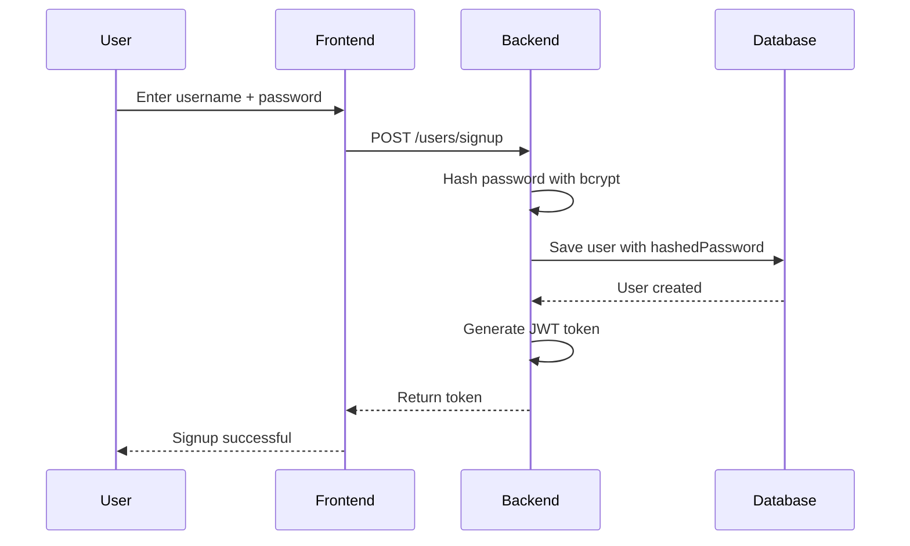
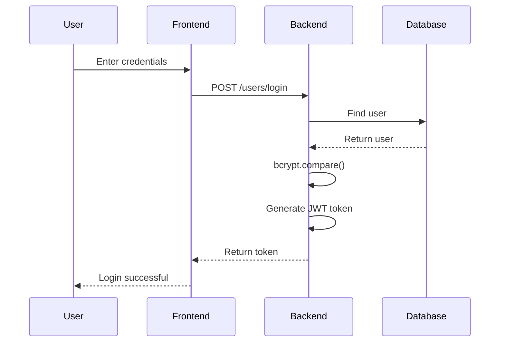
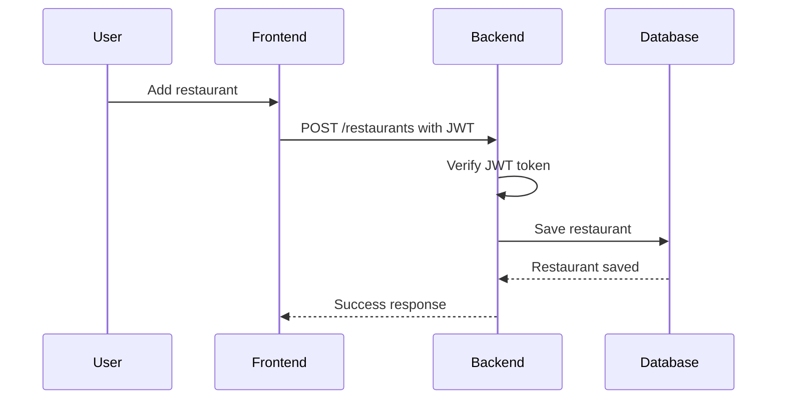

# Bytez

Bytez is a restaurant recommendation web app for discovering
restaurants in San Luis Obispo based on mood, cuisine, occasion,
and user preferences.

---

## Features

- User signup and login
- JWT authentication
- Protected restaurant creation routes
- Restaurant filtering
- Favorites system
- Restaurant mood tracking
- Personal restaurant notes
- MongoDB Atlas database integration

---

## Tech Stack

### Frontend

- React
- Vite
- JavaScript

### Backend

- Node.js
- Express

### Database

- MongoDB Atlas
- Mongoose

### Authentication

- bcrypt
- JSON Web Tokens (JWT)

---

## Running the Project

### Install Dependencies

```bash
npm install
```

### Start Frontend and Backend

```bash
npm run dev
```

### Frontend URL

```text
http://localhost:5173
```

### Backend URL

```text
http://localhost:3000
```

---

## Environment Variables

Create a `.env` file inside:

```text
packages/express-backend
```

Add:

```env
MONGO_URI=your_mongodb_connection_string
TOKEN_SECRET=your_secret_key
```

---

## Access Control

The app uses JWT authentication for protected backend routes.

### Public Routes

- `POST /users/signup`
- `POST /users/login`

### Protected Routes

- `POST /restaurants`
- `DELETE /restaurants/:id`
- `POST /api/restaurants/upload`

---

## Sequence Diagrams

### Signup Flow



### Login Flow



### Protected Request Flow



---

## Test User

```text
username: brian
password: test123
```
