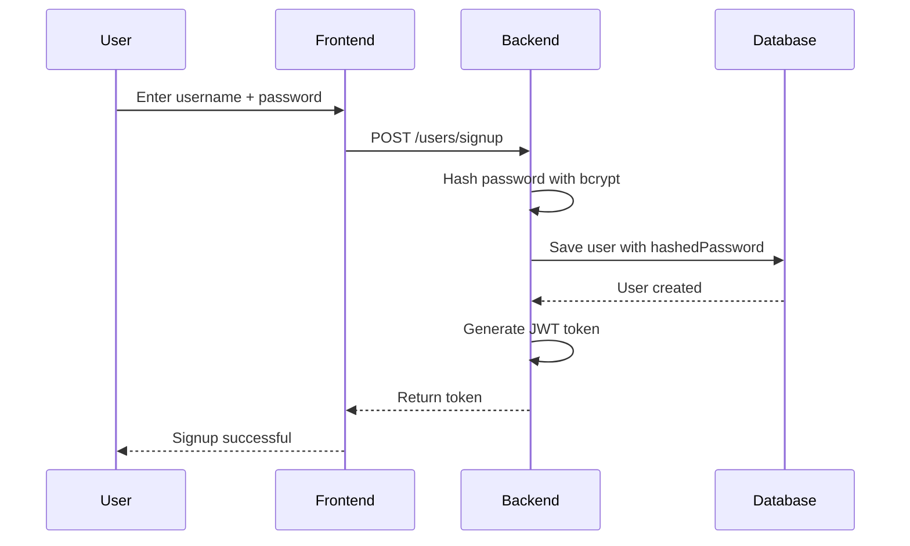
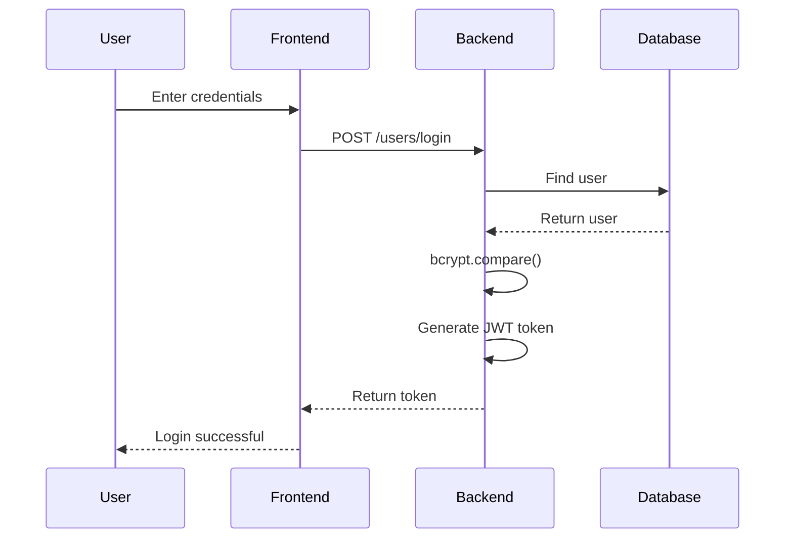
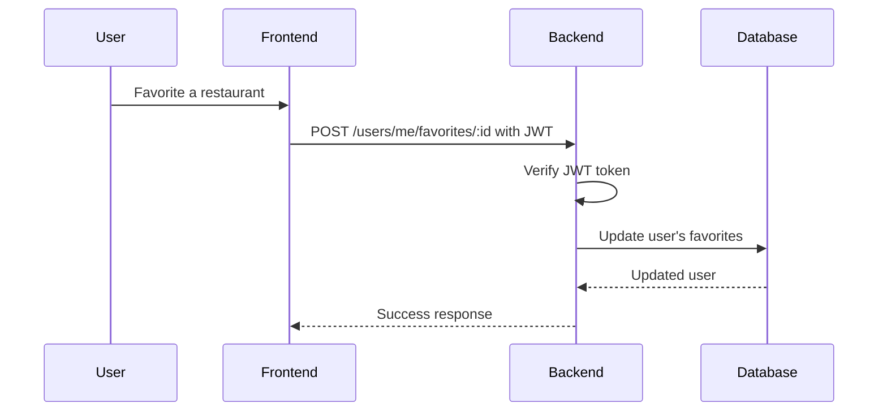

# Bytez

Bytez is a restaurant recommendation web app for discovering
restaurants in San Luis Obispo based on mood, cuisine, occasion,
and personal preferences. Each user has an account where they
can favorite restaurants, tag them with moods, and keep private
notes, all of which persist to their profile. The app is a
JavaScript monorepo: a React + Vite frontend talking to an
Express + MongoDB backend secured with JWT authentication.

---

## Live App

| Part     | URL                                                                        |
| -------- | -------------------------------------------------------------------------- |
| Frontend | <!-- TODO: paste the deployed Azure frontend URL --> _(deployed on Azure)_ |
| Backend  | https://bytez-api-fwgsard0b8h0bjcf.westus3-01.azurewebsites.net            |

### Test User

```text
username: brian
password: test123
```

You can also create a new account from the login screen with the
**Sign Up** toggle.

---

## UI Prototype

The interface was prototyped in Figma before implementation.

- Prototype:
  [Bytez — Main Page (Figma)](https://www.figma.com/make/goPO0vggSXGVmtNpk5NyqH/Bytes--Main-page?fullscreen=1&t=m1GkVEdHuBU9Utov-1)
- Last updated: 2026-06-09

---

## Features

- User signup and login with JWT authentication
- Restaurant browsing, search, sort, and multi-filter (cuisine,
  price, occasion, rating, mood, has-notes)
- Per-user favorites, moods, and private notes that persist to
  the account
- Add and delete restaurants (protected routes)
- Random restaurant picker
- MongoDB Atlas database integration

---

## Tech Stack

| Layer          | Technology                     |
| -------------- | ------------------------------ |
| Frontend       | React, Vite, JavaScript        |
| Backend        | Node.js, Express               |
| Database       | MongoDB Atlas, Mongoose        |
| Authentication | bcrypt, JSON Web Tokens (JWT)  |
| CI/CD          | GitHub Actions, Azure Web Apps |

---

## Documentation

- [Architecture overview](docs/architecture.md) — monorepo
  layout and how each module maps to a package
- [UML class diagram](docs/class-diagram.md) — data model and
  service classes
- [Contributing guide](CONTRIBUTING.md) — formatting, linting,
  and git workflow

---

## Development Environment Setup

These instructions are everything a new developer needs to run
the project locally from a fresh machine.

### Prerequisites

- **Node.js 20+** and npm (the CI builds on Node 20/24)
- **Git**
- A **MongoDB Atlas** connection string (or a local MongoDB
  instance)

### 1. Clone and install

This is an npm-workspaces monorepo, so a single install at the
root pulls dependencies for both packages.

```bash
git clone https://github.com/MillzMez/bytezApp.git
cd bytezApp
npm install
```

### 2. Configure environment variables

Create a `.env` file inside `packages/express-backend`:

```env
MONGODB_URI=your_mongodb_connection_string
TOKEN_SECRET=your_jwt_signing_secret
DEV_UPLOAD_KEY=your_developer_upload_key
# Optional:
# PORT=3000
# FRONTEND_URL=http://localhost:5173
```

- `MONGODB_URI` — MongoDB Atlas connection string
- `TOKEN_SECRET` — secret used to sign and verify JWTs
- `DEV_UPLOAD_KEY` — required by the protected spreadsheet
  upload route (`POST /api/restaurants/upload`)

These values are secrets and must **never** be committed. `.env`
is already covered by `.gitignore`.

### 3. Run the app

From the repo root, this starts the frontend and backend
together:

```bash
npm run dev
```

You can also run them individually:

```bash
npm run frontend   # Vite dev server only
npm run backend    # Express + nodemon only
```

| Service  | URL                   |
| -------- | --------------------- |
| Frontend | http://localhost:5173 |
| Backend  | http://localhost:3000 |

> Note: the frontend's API base URL is set in
> `packages/react-frontend/src/MyApp.jsx` (`API_PREFIX`). It
> points at the deployed backend by default; change it to
> `http://localhost:3000` to develop against a local backend.

### 4. Format and lint

```bash
npm run format   # apply Prettier
npm run lint     # check formatting (run in CI)
```

---

## Access Control

The app uses JWT authentication for protected backend routes.
The token is returned on login/signup and sent as a `Bearer`
token in the `Authorization` header.

### Public Routes

- `POST /users/signup`
- `POST /users/login`

### Protected Routes (require a valid JWT)

- `GET /restaurants`
- `POST /restaurants`, `DELETE /restaurants/:id`
- `GET /users/me`, `GET /users/me/favorites|notes|moods`
- `POST`/`DELETE /users/me/favorites/:restaurantId`
- `POST`/`PUT`/`DELETE /users/me/notes`
- `POST`/`DELETE /users/me/moods`
- `POST /api/restaurants/upload` (also requires the
  `x-dev-upload-key` header)

---

## Sequence Diagrams

### Signup Flow



### Login Flow



### Protected Request Flow


