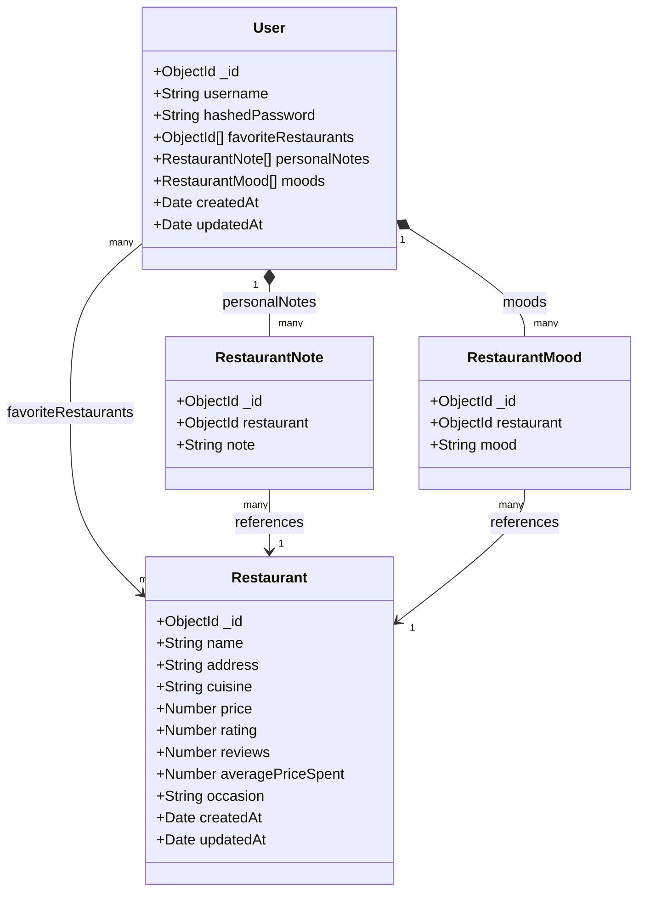
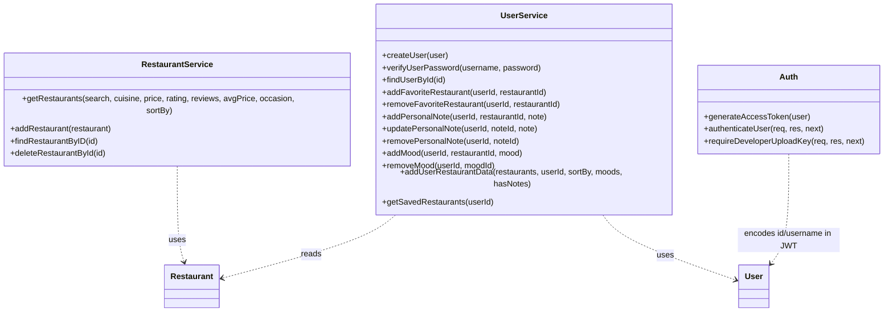

# UML Class Diagram

This diagram models the Bytez data layer (Mongoose schemas) and
the service classes that operate on it. The diagram is written
in Mermaid, so this Markdown file is also the editable source —
GitHub renders it automatically.

_Last updated: 2026-06-09_

## Data model

- `personalNotes` and `moods` are **embedded sub-documents** on
  the `User` (composition), each holding a reference to a
  `Restaurant`.
- `favoriteRestaurants` is an array of `Restaurant` references.

## Service layer

The services are the only modules that read or write the
database. Route handlers in `backend.js` delegate to them.

## Source

This file is the diagram source. To edit, modify the Mermaid
code blocks above; no external diagramming tool is required. The
diagrams can also be opened in the
[Mermaid Live Editor](https://mermaid.live) by pasting a code
block.
